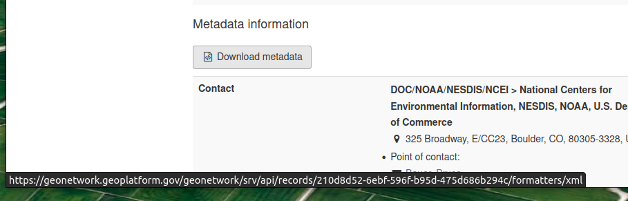

# Geonetwork 4 Local Development

## Running

```sh
docker-compose up -d
```

**m1 macbooks**

```sh
docker-compose -f docker-compose.yml -f docker-compose.m1-override.yml up -d
```

## Service URLs

### Geonetwork
http://localhost/geonetwork

- on first start, you may need to restart the geonetwork service as it will time out waiting for the database to initialize. 
- user/password is **admin/admin**
- You'll see an error message about the index when you start GN. This is because there are no records in GN.  For more information on importing records, see here: https://geonetwork-opensource.org/manuals/4.0.x/en/user-guide/describing-information/importing-metadata.html
- You can import any record in our GN by providing the link that's in Download metadata in the import.


### Kibana
> you must authenticate with Geonetwork first before accessing this URL, then you will be prompted for ES credentials (elastic/es_password)

http://localhost/geonetwork/dashboards


## To Do
- wait for database service in geonetwork
- volume mapping to geonetwork configuration (build own war file?)
- test and implement `ogc-api-records-service`